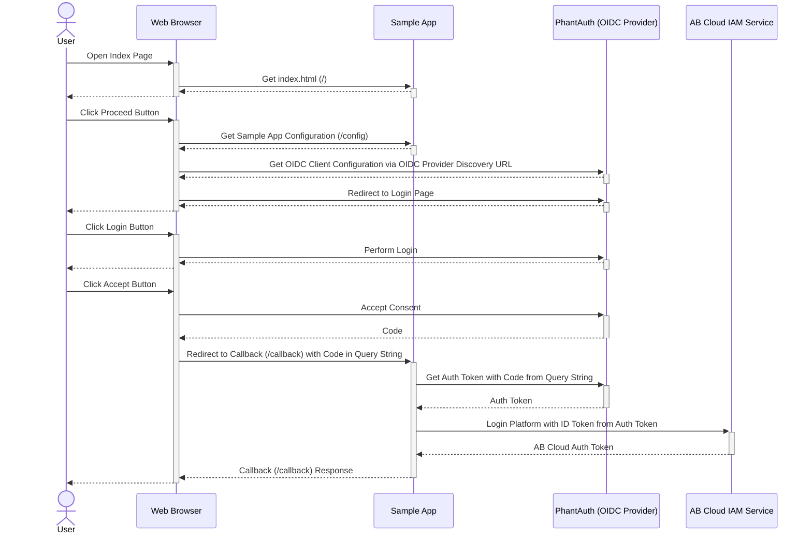

# AccelByte Cloud and 3rd Party OpenID Connect Login Integration Using AccelByte Go Server SDK

## Overview

AccelByte Cloud provides [integration with OpenID Connect providers](https://docs.accelbyte.io/guides/access/3rd-party-platform-integration.html#openid-connect) as one of the 3rd party login integration options. Any OpenID Connect providers should work. The following sample app will show you how to do this with AccelByte Go Server SDK and [PhantAuth](https://www.phantauth.net/), an OpenID Connect provider to simplify testing.

## Sample App

1. Clone [AccelByte Go Server SDK](https://github.com/AccelByte/accelbyte-go-sdk)
2. Go to [samples/oidc-web](https://github.com/AccelByte/accelbyte-go-sdk/tree/main/samples/oidc-web) folder
3. Follow the [README.md](https://github.com/AccelByte/accelbyte-go-sdk/blob/main/samples/oidc-web#readme) to setup and use the sample application

## How It Works

1. On sample app index page, when `Proceed` button is clicked:
    - Get sample app configuration from `/config` endpoint
    - Get OIDC Client configuration via OIDC provider `Discovery URL`, in this case `PhantAuth`
    - Redirect user to Phantauth Login and Consent page
2. After user is done with `Phantauth` Login and Consent page, `/callback` endpoint is called by `PhantAuth` with `code` in query string
3. In `/callback` endpoint:
    - Get auth token from `PhantAuth` with `code` from the query string
    - Perform login platform using `Platform ID` and `ID Token` from `PhantAuth` auth token
    - After login platform is successful, we can try to call some AccelByte Cloud endpoints



## Code Walktrough

### index.html

When `Proceed` button is clicked, get sample app configuration from `/config` endpoint, get OIDC Client configuration via OIDC Provider `Discovery URL`, and redirect user to Phantauth Login and Consent page.


```javascript
$('#proceed').click(function (e) {
    $.ajax({
        url: "/config",
        method: 'GET',
    }).done(function (config) {
        $.ajax({
            url: config.discovery_url,
            method: 'GET',
        }).done(function (resDiscovery) {
            const oidcClient = new Oidc.OidcClient({
                authority: resDiscovery.issuer,
                client_id: config.client_id,
                redirect_uri: (window.location.href + 'callback?provider=' + config.platform_id),
                response_type: "code",
                scope: config.scope,
                filterProtocolClaims: false,
                loadUserInfo: false
            });

            oidcClient.createSigninRequest({
                state: {
                    bar: Math.random()
                }
            }).then(function (req) {
                window.location = req.url;
            })
        });
    })
});
```

### main.go

#### Endpoint `/config`

Returns sample app configuration.

```go
// Handler for oidcclient config request from index.html
mux.HandleFunc("/config", func(w http.ResponseWriter, r *http.Request) {
		if r.Method == "GET" {
			oidcConfig := struct {
				Scope        string `json:"scope"`
				PlatformId   string `json:"platform_id"`
				DiscoveryUrl string `json:"discovery_url"`
				ClientSecret string `json:"client_secret"`
				ClientId     string `json:"client_id"`
			}{"openid profile email", platformId, discoveryUrl, clientSecretPhantAuth, clientIDPhantAuth}

			data, err := json.Marshal(oidcConfig)
			if err != nil {
				http.Error(w, err.Error(), http.StatusInternalServerError)

				return
			}

			w.Header().Set("Content-Type", "application/json")
			w.WriteHeader(http.StatusCreated)
			_, err = w.Write(data)
			if err != nil {
				return
			}
		}
	})

```

#### Endpoint `/callback`

Get auth token from `PhantAuth` with `code` from the query string and perform login platform using Platform ID and ID Token from PhantAuth auth token. After login platform is successful, we can try to call some AccelByte Cloud endpoints.

```go
// Handler for callback from PhantAuth
mux.HandleFunc("/callback", func(w http.ResponseWriter, r *http.Request) {
		form := url.Values{}
		form.Add("grant_type", "authorization_code")
		form.Add("client_id", clientIDPhantAuth)
		form.Add("client_secret", clientSecretPhantAuth)
		form.Add("redirect_uri", "http://localhost")
		form.Add("code", r.URL.Query().Get("code"))

		post, errPost := http.PostForm("https://phantauth.net/auth/token", form)
		if errPost != nil {
			return
		}
		bodyBytes, err := io.ReadAll(post.Body)
		if err != nil {
			log.Fatal(err)
		}
		response := token{}
		errUnmarshal := json.Unmarshal(bodyBytes, &response)
		if errUnmarshal != nil {
			return
		}

		// Login Platform from AccelByte Cloud
		loginPlatform(*response.IDToken)

		// Try to call AccelByte Cloud after login success
		getCountryLocation()

		w.WriteHeader(http.StatusOK)
		w.Header().Set("Content-Type", "application/text")
		_, err = w.Write([]byte("Success Login Using OIDC-Web Sample App"))
		if err != nil {
			return
		}
	})

```

