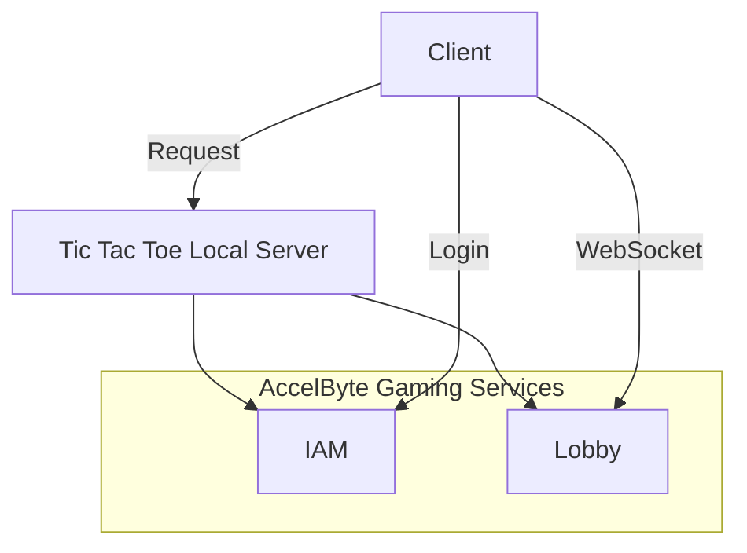
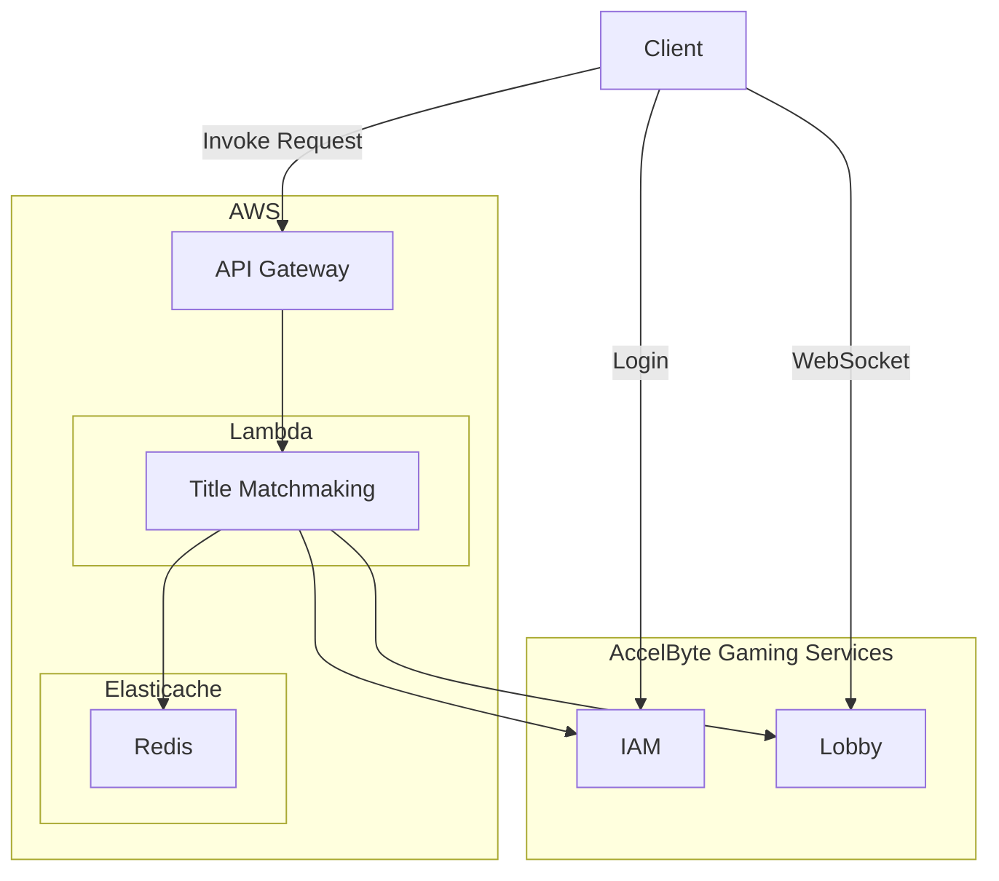
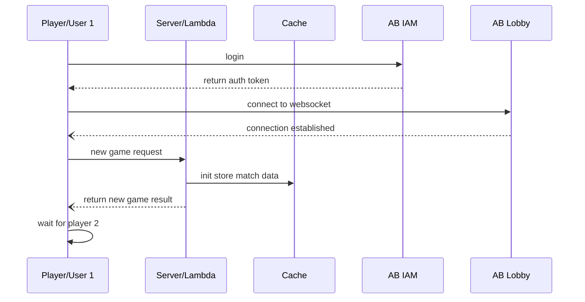
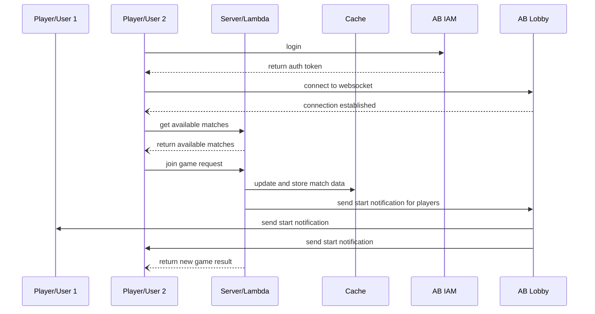
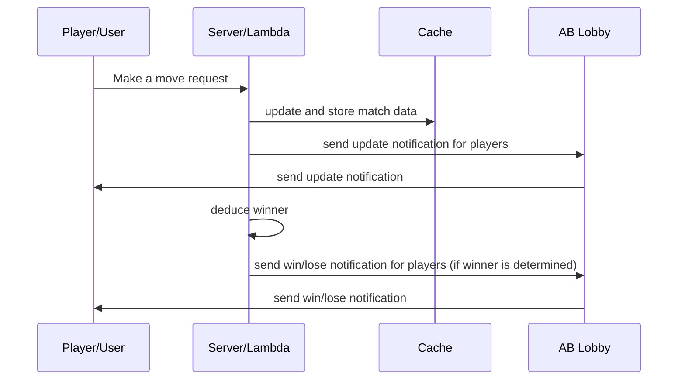

# Tic Tac Toe using AccelByte Go Extend SDK

## Overview
This tutorial will explain on how to use AccelByte Go Extend SDK to create simple Tic Tac Toe backend service and game client. This tutorial also will explain on how to configure and run the provided local server sample as well as AWS Lambda sample.

## Prerequisites
- [Create a Game Namespace](https://docs.accelbyte.io/esg/uam/namespaces.html#tutorials) if you don't have one yet. Be sure to keep the namespace's **ID** as you will need it later.
- [Create and OAuth Client](https://docs.accelbyte.io/esg/uam/iam-client.html#managing-clients-in-the-admin-portal) with a **confidential** client type. Keep the **Client ID** and the **Client Secret** somewhere safe as you will be using them in this tutorial. Make sure you add these permissions for the oauth client.
	- `NAMESPACE:<namespace>:USER:*:NOTIFICATION` CREATE, UPDATE
	- `NAMESPACE:<namespace>:USER` READ
- Download the latest [Go SDK](https://github.com/AccelByte/accelbyte-go-sdk)
- Read [Go SDK Getting Started Guide](https://docs.accelbyte.io/guides/customization/golang-sdk-guide.html) on how to integrate SDK into your project.
- AWS account with enough permission to deploy Lambda function (optional).
- At least two username registered in AccelByte Gaming Services for testing purpose.

## How it Works (Server-Side)
### Architecture for Local Server


### Architect for AWS Lambda


#### Sequence Diagram for New Game Request


#### Sequence Diagram for Join Game Request


#### Sequence Diagram for Make a Move Request


## Using Sample Applications

### AWS Lambda Function Locally
- Go to `samples/tic-tac-toe` directory.
- Copy `serverless.template.sample` to `serverless.template` and fill all required environment variables inside the template file.
- In terminal, run `sam build` to build a binary file.
- To run locally, use `sam local start-api --template serverless.template`.
- Use `http://127.0.0.1:3000` as matchmaking server url in client sample app.

### AWS Lambda Function on AWS
- Go to `samples/tic-tac-toe` directory.
- Copy `serverless.template.sample` to `serverless.template` and fill all required environment variables inside the template file.
- In terminal, run `sam build` to build a binary file.
- To deploy lambda function, use `sam deploy --guide --template serverless.template`.
- Find your API Gateway Endpoint URL in the output values displayed after deployment and use it as matchmaking server url in client sample app.

### Game Client (AWS Lambda)
- For matchmaking client sample application, go to `samples/tic-tac-toe/client` directory.
- Configure environment variables for AccelByte Gaming Services connection or use JSON config file as mentioned in project's [README](../../samples/tic-tac-toe/README.md).
- You can choose to configure user's credentials directly using JSON file or command line options. Refer to the README on how to use it.
- Make sure you deploy Tic-Tac-Toe Lambda function first either on AWS or local.
- Export the url `TIC_TAC_TOE_ENDPOINT`. eg. `http://127.0.0.1:3000` without `/{proxy+}`
- Run the application using `go run main.go`.

### Run Game Client as a Player 1
1. Follow above Game Client steps.
2. For example:
```bash
# with assumption that AccelByte Gaming Services config is available in environment variables
$ go run main.go
```
3. You will be presented with a simple menu similar to this:
```bash
Commands:
# Tic-tac-toe client app
a: Login
b: Create Matchmaking
c: User info
d: Logout
e: Get game stat
```
4. Type `a` and hit `enter` to login to AccelByte Gaming Services.
5. After succesfully logged in, you will be back to main menu.
```bash
Commands:
# Tic-tac-toe client app
a: Login
b: Create Matchmaking
c: User info
d: Logout
e: Get game stat
```
6. Now, type `b` and hit `enter` to start a new match.
7. The console should change to something like this:
```bash
Successful create matchmaking for tic-tac-toe! 
```
Indicating that the game client now waiting for other player (player 2) to join.
8. Now, as player 1 you need to wait until player 2 joined.
9. After player 2 joined, the console screen should change to game board.
```bash
INFO[0081] Match found !                                

-----------------------------------------------------
0 | 1 | 2
_________

3 | 4 | 5
_________

6 | 7 | 8
-----------------------------------------------------
INFO[0081] It's your turn (O), input index:            
```
10. You can input which cell you want to tag with your symbol. In this game, player 1 is `o` and player 2 is `x`. The format is number (0-8). After you choose the number, just hit `enter`. The number will change imidiately with the symbol (`o` or `x`)
11. Continue the game until one of the players is the winner.
12. After the game concluded, the console will change to this:
```bash
# Terminal shows
INFO[0191] You win ! 

# Terminal shows
INFO[0140] You lose 
```

### Run Game Client as a Player 2
1. Follow similar step like above until step number 5.
2. Now, type `3` and hit `enter` to join an existing match.
3. If there are any available match, the server will directly matching the players.
4. The console should change to game board now.
```bash
Commands:
# Tic-tac-toe client app
a: Login
b: Create Matchmaking
c: User info
d: Logout
e: Get game stat
b
INFO[0030] Match found !                                

-----------------------------------------------------
0 | 1 | 2
_________

3 | 4 | 5
_________

6 | 7 | 8
-----------------------------------------------------
INFO[0030] Waiting your opponent move             
```
5. Since player 1 has the first turn. So the player 2 will get message `Other player's Turn.` instead of cell input.
6. Wait until your turn, and if the console updated, you can input your move with similar step like the step number 10 above.
7. Continue the game until one of the players is the winner.
8. After the game concluded, the console will change to this:
```bash
# Terminal shows
INFO[0191] You win ! 

# Terminal shows
INFO[0140] You lose 
```

## Code Behind

### Game Client
- Initializing AccelByte Gaming Services SDK
```go
configImpl    = *auth.DefaultConfigRepositoryImpl()
tokenImpl     = *auth.DefaultTokenRepositoryImpl()
oauthService  = iam.OAuth20Service{
    Client:           factory.NewIamClient(&configImpl),
    ConfigRepository: &configImpl,
    TokenRepository:  &tokenImpl,
}
connMgr *utils.ConnectionManagerImpl
```

- Login and Connecting to Lobby WS Service
```go
// input for login
fmt.Println("Username/E-mail: ")
username := getInput()
fmt.Println("Password: ")
password := getInput()

// request to IAM to login using AccelByte Go SDK
err := oauthService.Login(username, password)
if err != nil {
    logrus.Error("Login Failed")

    return
}
logrus.Info("Login Successful")

// listening message from lobby using AccelByte Go SDK
logrus.Info("Enter websocket mode")
connMgr = &utils.ConnectionManagerImpl{}
connection, err := connectionutils.NewWebsocketConnection(
    oauthService.ConfigRepository,
    oauthService.TokenRepository,
    websocketMessageHandler)
if err != nil {
    panic(err)
}
connMgr.Save(connection)
```

- New Game
```go
func createMatchmaking() error {
	token, err := oauthService.TokenRepository.GetToken()
	if err != nil {
		return err
	}
	_, err = utils.SimpleHTTPCall(utils.GetClient(), createMatchEndpoint, "POST", "Bearer "+*token.AccessToken, nil)
	if err != nil {
		return err
	}
	logrus.Info("Successful create matchmaking for tic-tac-toe!")

	return nil
}
```

- Get statistic
```go
func getStat() (*models.MatchTable, error) {
	token, err := oauthService.TokenRepository.GetToken()
	if err != nil {
		return nil, err
	}
	response, errResponse := utils.SimpleHTTPCall(utils.GetClient(), getStatEndpoint, "GET", "Bearer "+*token.AccessToken, nil)
	if errResponse != nil {
		return nil, errResponse
	}
	responseBody, errResponseBody := ioutil.ReadAll(response.Body)
	if errResponseBody != nil {
		return nil, errResponseBody
	}
	matchTable := models.MatchTable{}
	errUnmarshal := json.Unmarshal(responseBody, &matchTable)
	if errUnmarshal != nil {
		return nil, errUnmarshal
	}

	return &matchTable, nil
}

```

- Playing the game
```go
func playingGame(input string) {
	intIndex, err := strconv.Atoi(input)
	if err != nil {
		logrus.Error("error convert")

		return
	}
	move := &models.MoveRequest{
		Index:     intIndex,
		PlayerNum: playerNum,
	}
	resp, errResp := makeMove(*move)
	if errResp != nil {
		logrus.Errorf("Error while make move: %s", errResp.Error())

		return
	}
	renderBoard(resp.BoardStatus)
	if resp.MatchStatus == GameOver {
		if resp.Winner == playerNum {
			logrus.Infof("You win !")
			gameStatus = Win
		} else if resp.Winner == 3 {
			logrus.Infof("Draw !")
			gameStatus = Draw
		} else {
			logrus.Infof("You lose !")
			gameStatus = Lose
		}
	} else if resp.MatchStatus == Playing {
		logrus.Info("Waiting for your opponent move")
	}
}
```

- Make a Move
```go
func makeMove(request models.MoveRequest) (*models.MoveResponse, error) {
	token, err := oauthService.TokenRepository.GetToken()
	if err != nil {
		return nil, err
	}
	requestBody, errRequestBody := json.Marshal(request)
	if errRequestBody != nil {
		return nil, errRequestBody
	}
	response, errResponse := utils.SimpleHTTPCall(utils.GetClient(), moveEndpoint, "POST", "Bearer "+*token.AccessToken, requestBody)
	if errResponse != nil {
		return nil, errResponse
	}
	responseBody, errResponseBody := ioutil.ReadAll(response.Body)
	if errResponseBody != nil {
		return nil, errResponseBody
	}
	if response.StatusCode == http.StatusOK {
		moveResponse := &models.MoveResponse{}
		err = json.Unmarshal(responseBody, moveResponse)
		if err != nil {
			return nil, err
		}

		return moveResponse, nil
	} else if response.StatusCode == http.StatusForbidden {
		logrus.Info(string(responseBody))

		return nil, fmt.Errorf("forbidden move, try again: ")
	} else {
		logrus.Info(string(responseBody))

		return nil, err
	}
}
```

### Server
Both Local server and AWS Lambda function use the same code for tic tac toe logic.

- AB Cloud IAM User Validation
```go
// verify token and get userID
input := &o_auth2_0.VerifyTokenV3Params{
    Token: reqToken,
}
claims, errClaims := oauth20Service.VerifyTokenV3Short(input)
if claims == nil {
    message := "Claim is empty. " + err.Error()

    return events.APIGatewayProxyResponse{StatusCode: http.StatusUnauthorized, Body: fmt.Sprint(message)}, nil
}
if errClaims != nil {
    message := "Unable to validate and parse token. " + errClaims.Error()
    log.Print(message)

    return events.APIGatewayProxyResponse{StatusCode: http.StatusUnauthorized, Body: fmt.Sprint(errClaims.Error())}, nil
}
```

- Getting an Username from User Id from AB Cloud IAM Service
```go
userID := *claims.UserID
namespace := *claims.Namespace
```

- Sending Notification to User using AB Cloud Lobby Service
```go
// GO-SDK lobby service
func sendFreeformNotification(namespace, userID, message string) error {
	topic := constants.NotificationTopic
	content := lobbyclientmodels.ModelFreeFormNotificationRequest{
		Message: &message,
		Topic:   &topic,
	}
	input := &notification.FreeFormNotificationByUserIDParams{
		Body:      &content,
		Namespace: namespace,
		UserID:    userID,
	}
	sendNotificationSearchingErr := gameNotificationService.FreeFormNotificationByUserIDShort(input)
	if sendNotificationSearchingErr != nil {
		log.Printf("Unable to send notification match searching to lobby. userID: %+v", userID)
		log.Print(sendNotificationSearchingErr.Error())

		return sendNotificationSearchingErr
	}

	return nil
}
```

- Process a New Game/Match Request and Process a Join Game/Match Request
```go
// for path variable MATCH
func (t *TicTacToeService) createMatchHandler(userID, namespace string) events.APIGatewayProxyResponse {
	ctx, cancel := context.WithTimeout(context.Background(), 10*time.Second)
	defer cancel()

	keyPrefix := constants.Match
	keys, err := t.ticTacToeDAORedis.Redis.Keys(ctx, "*match*").Result()
	log.Printf("length of db is %d", len(keys))
	if len(keys) == 1 {
		log.Print("There is already 1 player")
		log.Printf("this is pRequester key %s", keys[0])
		if err != nil {
			log.Println(err.Error())

			return events.APIGatewayProxyResponse{
				StatusCode: http.StatusInternalServerError, Body: err.Error(),
			}
		}
		pRequesterRawData, errRequesterRawData := t.ticTacToeDAORedis.Redis.Get(ctx, keys[0]).Result()
		if errRequesterRawData != nil {
			log.Print(errRequesterRawData.Error())

			return events.APIGatewayProxyResponse{
				StatusCode: http.StatusInternalServerError, Body: errRequesterRawData.Error(),
			}
		} else {
			log.Println("key2", pRequesterRawData)
		}
		log.Printf("this is pRequesterRawData %s", pRequesterRawData)
		pRequesterData := models.MatchTable{}
		err = json.Unmarshal([]byte(pRequesterRawData), &pRequesterData)
		if err != nil {
			return events.APIGatewayProxyResponse{
				StatusCode: http.StatusInternalServerError, Body: err.Error(),
			}
		}
		pRequesterData.MatchStatus = constants.Playing
		opponentData := models.MatchTable{
			UserID:      userID,
			MatchStatus: constants.Playing,
			Winner:      -1,
			PlayerTurn:  1,
			PlayerNum:   2,
			BoardStatus: "000000000",
		}
		pRequesterMarshall, errRequesterMarshall := json.Marshal(pRequesterData)
		if errRequesterMarshall != nil {
			return events.APIGatewayProxyResponse{
				StatusCode: http.StatusInternalServerError, Body: errRequesterMarshall.Error(),
			}
		}
		opponentMarshall, errOpponentMarshall := json.Marshal(opponentData)
		if errOpponentMarshall != nil {
			return events.APIGatewayProxyResponse{
				StatusCode: http.StatusInternalServerError, Body: errOpponentMarshall.Error(),
			}
		}
		t.ticTacToeDAORedis.Redis.Set(ctx, keyPrefix+pRequesterData.UserID, pRequesterMarshall, redis.RedisExpTime)
		t.ticTacToeDAORedis.Redis.Set(ctx, keyPrefix+opponentData.UserID, opponentMarshall, redis.RedisExpTime)

		// call lobby free form to userid 1 and user id 2 that match found
		log.Printf("player 1 = %s", pRequesterData.UserID)
		log.Printf("player 2 = %s", opponentData.UserID)
		err = sendFreeformNotification(namespace, pRequesterData.UserID, "found 1")
		if err != nil {
			log.Printf("Cannot send free form notif to userID %s, error : %s", pRequesterData.UserID, err.Error())
		}
		err = sendFreeformNotification(namespace, opponentData.UserID, "found 2")
		if err != nil {
			log.Printf("Cannot send free form notif to userID %s, error : %s", pRequesterData.UserID, err.Error())
		}

		// response the match request to user id 2
		return events.APIGatewayProxyResponse{
			StatusCode: http.StatusOK,
		}
	} else if len(keys) >= 2 {
		log.Print("There is already 2 player")
		t.ticTacToeDAORedis.Redis.FlushAll(ctx)
		t.saveInitDB(ctx, userID)

		return events.APIGatewayProxyResponse{
			StatusCode: http.StatusOK,
		}
	} else if len(keys) == 0 {
		log.Print("0 player")
		t.saveInitDB(ctx, userID)

		return events.APIGatewayProxyResponse{
			StatusCode: http.StatusOK,
		}
	}

	return events.APIGatewayProxyResponse{
		StatusCode: http.StatusInternalServerError, Body: "cannot save to redis. " + err.Error(),
	}
}
```
- Make a Move
```go
// for path variable MOVE
func (t *TicTacToeService) makeMoveHandler(requestBody, namespace, userID string) events.APIGatewayProxyResponse {
	ctx, cancel := context.WithTimeout(context.Background(), 10*time.Second)
	defer cancel()

	keyPrefix := constants.Match
	moveRequest := models.MoveRequest{}
	err := json.Unmarshal([]byte(requestBody), &moveRequest)
	if err != nil {
		log.Println(err.Error())

		return events.APIGatewayProxyResponse{
			StatusCode: http.StatusInternalServerError, Body: err.Error(),
		}
	}
	log.Printf("this is request: index: %d, playerNum: %d", moveRequest.Index, moveRequest.PlayerNum)
	keyUserID := keyPrefix + userID
	pRequesterRawData, errRequesterRawData := t.ticTacToeDAORedis.Redis.Get(ctx, keyUserID).Result()
	if errRequesterRawData != nil {
		log.Println(errRequesterRawData.Error())

		return events.APIGatewayProxyResponse{
			StatusCode: http.StatusInternalServerError, Body: errRequesterRawData.Error(),
		}
	} else {
		log.Println("key2", pRequesterRawData)
	}
	log.Printf("this is p1Data %s", pRequesterRawData)
	pRequesterData := models.MatchTable{}
	err = json.Unmarshal([]byte(pRequesterRawData), &pRequesterData)
	if err != nil {
		return events.APIGatewayProxyResponse{
			StatusCode: http.StatusInternalServerError, Body: fmt.Sprintf("Error unmarshall with error: %s", err.Error()),
		}
	}
	log.Printf("matchdataP1 userid: %s", pRequesterData.UserID)
	log.Printf("request userid: %s", userID)
	if pRequesterData.UserID != userID {
		return events.APIGatewayProxyResponse{
			StatusCode: http.StatusNotFound, Body: "User Not Found",
		}
	}
	if pRequesterData.PlayerTurn != pRequesterData.PlayerNum {
		return events.APIGatewayProxyResponse{
			StatusCode: http.StatusForbidden, Body: "It's not your turn",
		}
	}
	if pRequesterData.MatchStatus != constants.Playing {
		return events.APIGatewayProxyResponse{
			StatusCode: http.StatusForbidden, Body: "Match is " + pRequesterData.MatchStatus,
		}
	}
	if !isMoveAllowed(moveRequest.Index, pRequesterData.BoardStatus) {
		return events.APIGatewayProxyResponse{
			StatusCode: http.StatusForbidden, Body: fmt.Sprintf("Cannot sign for player %d at index %d", moveRequest.PlayerNum, moveRequest.Index),
		}
	}

	//get opponent data
	key, err := t.ticTacToeDAORedis.Redis.Keys(ctx, "*").Result()
	if err != nil {
		return events.APIGatewayProxyResponse{
			StatusCode: http.StatusInternalServerError, Body: fmt.Sprintf("Error get data from redis: %s", err.Error()),
		}
	}
	var opponentKey string
	for i := 0; i < 2; i++ {
		if key[i] != keyPrefix+userID {
			opponentKey = key[i]
		}
	}
	log.Printf("this is key: %s", key[0])
	opponentRawData, err := t.ticTacToeDAORedis.Redis.Get(ctx, opponentKey).Result()
	if err != nil {
		return events.APIGatewayProxyResponse{
			StatusCode: http.StatusInternalServerError, Body: fmt.Sprintf("Error get data from redis: %s", err.Error()),
		}
	}
	opponentData := models.MatchTable{}
	err = json.Unmarshal([]byte(opponentRawData), &opponentData)
	if err != nil {
		return events.APIGatewayProxyResponse{
			StatusCode: http.StatusInternalServerError, Body: fmt.Sprintf("Error marshall with error: %s", err.Error()),
		}
	}
	log.Printf("this is opponentRawData: %s", opponentRawData)
	log.Printf("this is requesterRawData: %s", pRequesterRawData)
	updatedBoard := replaceAtIndex(pRequesterData.BoardStatus, fmt.Sprint(pRequesterData.PlayerNum), moveRequest.Index)
	if pRequesterData.PlayerTurn == 1 {
		pRequesterData.PlayerTurn = 2
		opponentData.PlayerTurn = 2
	} else {
		pRequesterData.PlayerTurn = 1
		opponentData.PlayerTurn = 1
	}
	log.Printf("this is updatedBoard: %s", pRequesterData.BoardStatus)
	pRequesterData.BoardStatus = updatedBoard
	opponentData.BoardStatus = updatedBoard
	checkWinnerUpdate := checkWinner(updatedBoard)
	pRequesterData.Winner = checkWinnerUpdate
	opponentData.Winner = checkWinnerUpdate
	moveResponse := &models.MoveResponse{
		BoardStatus: pRequesterData.BoardStatus,
		Winner:      checkWinnerUpdate,
	}
	if checkWinnerUpdate == 1 || checkWinnerUpdate == 2 {
		pRequesterData.MatchStatus = constants.GameOver
		opponentData.MatchStatus = constants.GameOver
		moveResponse.MatchStatus = constants.GameOver
		marshal, errMarshal := json.Marshal(moveResponse)
		if errMarshal != nil {
			return events.APIGatewayProxyResponse{
				StatusCode: http.StatusInternalServerError, Body: fmt.Sprintf("Error marshall p1 with error: %s", errMarshal.Error()),
			}
		}
		pRequesterMarshall, errRequesterMarshall := json.Marshal(pRequesterData)
		if errRequesterMarshall != nil {
			return events.APIGatewayProxyResponse{
				StatusCode: http.StatusInternalServerError, Body: fmt.Sprintf("Error marshall p1 with error: %s", errRequesterMarshall.Error()),
			}
		}
		opponentMarshall, errOpponentMarshall := json.Marshal(opponentData)
		if errOpponentMarshall != nil {
			return events.APIGatewayProxyResponse{
				StatusCode: http.StatusInternalServerError, Body: fmt.Sprintf("Error marshall opponentData with error: %s", errOpponentMarshall.Error()),
			}
		}
		log.Printf("this is pRequesterMarshall: %s", string(pRequesterMarshall))
		log.Printf("this is opponentMarshall: %s", string(opponentMarshall))
		t.ticTacToeDAORedis.Redis.Set(ctx, keyPrefix+userID, string(pRequesterMarshall), redis.RedisExpTime)
		t.ticTacToeDAORedis.Redis.Set(ctx, keyPrefix+opponentData.UserID, string(opponentMarshall), redis.RedisExpTime)
		if pRequesterData.PlayerNum == checkWinnerUpdate {
			err = sendFreeformNotification(namespace, opponentData.UserID, constants.Lose+" "+opponentData.BoardStatus)
			if err != nil {
				log.Printf("Cannot send free form notif to userID %s, error : %s", opponentData.UserID, err.Error())
			}
		}

		return events.APIGatewayProxyResponse{
			StatusCode: http.StatusOK, Body: string(marshal),
		}
	} else if checkWinnerUpdate == 0 {
		pRequesterData.MatchStatus = constants.Playing
		opponentData.MatchStatus = constants.Playing
		moveResponse.MatchStatus = constants.Playing
		marshal, errMarshal := json.Marshal(moveResponse)
		if errMarshal != nil {
			return events.APIGatewayProxyResponse{
				StatusCode: http.StatusInternalServerError, Body: fmt.Sprintf("Error marshall p1 with error: %s", errMarshal.Error()),
			}
		}
		pRequesterMarshall, errRequesterMarshall := json.Marshal(pRequesterData)
		if errRequesterMarshall != nil {
			return events.APIGatewayProxyResponse{
				StatusCode: http.StatusInternalServerError, Body: fmt.Sprintf("Error marshall p1 with error: %s", errRequesterMarshall.Error()),
			}
		}
		opponentMarshall, errOpponentMarshall := json.Marshal(opponentData)
		if errOpponentMarshall != nil {
			return events.APIGatewayProxyResponse{
				StatusCode: http.StatusInternalServerError, Body: fmt.Sprintf("Error marshall opponentData with error: %s", errOpponentMarshall.Error()),
			}
		}
		log.Printf("this is pRequesterMarshall: %s", string(pRequesterMarshall))
		log.Printf("this is opponentMarshall: %s", string(opponentMarshall))
		t.ticTacToeDAORedis.Redis.Set(ctx, keyPrefix+userID, string(pRequesterMarshall), redis.RedisExpTime)
		t.ticTacToeDAORedis.Redis.Set(ctx, keyPrefix+opponentData.UserID, string(opponentMarshall), redis.RedisExpTime)
		err = sendFreeformNotification(namespace, opponentData.UserID, constants.Playing+fmt.Sprint(opponentData.PlayerNum)+" "+opponentData.BoardStatus)
		if err != nil {
			log.Printf("Cannot send free form notif to userID %s, error : %s", opponentData.UserID, err.Error())
		}
		if err != nil {
			return events.APIGatewayProxyResponse{}
		}

		return events.APIGatewayProxyResponse{
			StatusCode: http.StatusOK, Body: string(marshal),
		}
	} else {
		pRequesterData.MatchStatus = constants.GameOver
		opponentData.MatchStatus = constants.GameOver
		moveResponse.MatchStatus = constants.GameOver
		marshal, errMarshal := json.Marshal(moveResponse)
		if errMarshal != nil {
			return events.APIGatewayProxyResponse{
				StatusCode: http.StatusInternalServerError, Body: fmt.Sprintf("Error marshall with error: %s", errMarshal.Error()),
			}
		}
		pRequesterMarshall, errRequesterMarshall := json.Marshal(pRequesterData)
		if errRequesterMarshall != nil {
			return events.APIGatewayProxyResponse{
				StatusCode: http.StatusInternalServerError, Body: fmt.Sprintf("Error marshall pRequesterData with error: %s", errRequesterMarshall.Error()),
			}
		}
		opponentMarshall, errOpponentMarshall := json.Marshal(opponentData)
		if errOpponentMarshall != nil {
			return events.APIGatewayProxyResponse{
				StatusCode: http.StatusInternalServerError, Body: fmt.Sprintf("Error marshall opponentData with error: %s", errOpponentMarshall.Error()),
			}
		}
		log.Printf("this is pRequesterMarshall: %s", string(pRequesterMarshall))
		log.Printf("this is opponentMarshall: %s", string(opponentMarshall))
		t.ticTacToeDAORedis.Redis.Set(ctx, keyPrefix+userID, string(pRequesterMarshall), redis.RedisExpTime)
		t.ticTacToeDAORedis.Redis.Set(ctx, keyPrefix+opponentData.UserID, string(opponentMarshall), redis.RedisExpTime)
		err = sendFreeformNotification(namespace, opponentData.UserID, constants.Draw+" "+pRequesterData.BoardStatus)
		if err != nil {
			log.Printf("Cannot send free form notif to userID %s, error : %s", opponentData.UserID, err.Error())
		}
		if err != nil {
			return events.APIGatewayProxyResponse{}
		}

		return events.APIGatewayProxyResponse{
			StatusCode: http.StatusOK, Body: string(marshal),
		}
	}
}
```

- Get Statistic
```go
// for path variable STAT
func (t *TicTacToeService) getStatHandler(userID string) events.APIGatewayProxyResponse {
	ctx, cancel := context.WithTimeout(context.Background(), 10*time.Second)
	defer cancel()
	keyPrefix := constants.Match
	keyUserID := keyPrefix + userID
	playerData, err := t.ticTacToeDAORedis.Redis.Get(ctx, keyUserID).Result()
	if err != nil {
		return events.APIGatewayProxyResponse{}
	}

	return events.APIGatewayProxyResponse{
		StatusCode: 200, Body: playerData,
	}
}
```

- Determine who is the winner
```go
// return 0 : still playing, 1 : requester player win, 2 : opponent win, 3 : draw
func checkWinner(boardState string) int {
	var winningCombos = [][]int{
		{0, 1, 2},
		{3, 4, 5},
		{6, 7, 8},
		{0, 3, 6},
		{1, 4, 7},
		{2, 5, 8},
		{0, 4, 8},
		{2, 4, 6},
	}
	for _, val := range winningCombos {
		a := val[0]
		b := val[1]
		c := val[2]
		checkNum, err := strconv.Atoi(string(boardState[a]))
		if err != nil {
			log.Fatalf("Error convert string to int %s: ", err)
		}
		if checkNum != 0 && (checkNum == 1 || checkNum == 2) {
			if boardState[a] == boardState[b] && boardState[b] == boardState[c] && boardState[a] == boardState[c] {
				log.Printf("Congratulation! player %s win the game", string(boardState[a]))
				number, errNumber := strconv.Atoi(string(boardState[a]))
				if errNumber != nil {
					log.Printf("Error convert string to int. %s", errNumber.Error())
				}

				return number
			}
		}
	}
	isMatchDraw, err := regexp.MatchString(`0+`, boardState)
	if err != nil {
		return 0
	}
	if !isMatchDraw {
		return 3
	}

	return 0
}
```