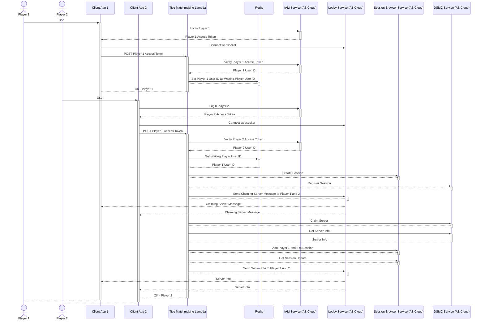

# Title Matchmaking Using AccelByte Go Server SDK

## Overview

We can perform a simple matchmaking with AccelByte Cloud services and AWS Lambda developed using AccelByte Go Server SDK. 

The sample app consists of two parts: the lambda itself and the client app that is used by players.

## Sample App

1. Clone [AccelByte Go Server SDK](https://github.com/AccelByte/accelbyte-go-sdk) 
2. Go to [samples/title-matchmaking](https://github.com/AccelByte/accelbyte-go-sdk/tree/main/samples/title-matchmaking) folder
3. Follow the [README.md](https://github.com/AccelByte/accelbyte-go-sdk/blob/main/samples/title-matchmaking#readme) to setup and use the sample application

## How It Works

### Player 1

1. Client app logs in player #1 to AB Cloud and get an access token
2. Client app connect to AB Cloud Lobby Service websocket and waiting for messages from title matchmaking lambda
2. Client app post player #1 access token to title matchmaking lambda
3. Receiving client app post data, title matchmaking lambda performs the following:
    - Contact AB Cloud to verify player #1 access token and get the user id
    - Check Redis to see if there is a player waiting for matchmaking. If no, then store player #1 user id as the user who waits for matchmaking

### Player 2

1. Client app logs in player #2 to AB Cloud and get an access token
2. Client app connect to AB Cloud Lobby Service websocket and waiting for messages from title matchmaking lambda
2. Client app post player #2 access token to title matchmaking lambda
3. Receiving client app post data, title matchmaking lambda performs the following:
    - Contact AB Cloud to verify player #2 access token and get the user id
    - Check Redis to see if there is a player waiting for matchmaking. If yes, then take that user id as Player 1 for matchmaking
    - Contact AB Cloud to perform the following.
        - Create session
        - Register session to DSMC
        - Claim server
        - Get server info 
        - Add player to session
        - Get session update
        - Send notification for all players (Player #1 and #2) containing server info



## Code Walktrough

### Client App

#### Login User to IAM Service (AB Cloud)

```go
func login() {
	fmt.Println("Username/E-mail: ")
	username := getInput()
	fmt.Println("Password: ")
	password := getInput()
	err := userService.Login(username, password)
	if err != nil {
		logrus.Error("Login Failed")

		return
	}
	logrus.Info("Login Successful")
}
```

#### Connect to Lobby Service (AB Cloud) Websocket

```go
// listening message from lobby
	reader := bufio.NewReader(os.Stdin)
	logrus.Info("Enter websocket mode")
	connMgr = &utils.ConnectionManagerImpl{}
	connection, err := connectionutils.NewWebsocketConnection(oauthService.ConfigRepository, oauthService.TokenRepository, lobbyMessageHandler)
	if err != nil {
		panic(err)
	}
	connMgr.Save(connection)
	notificationService = &service.NotificationServiceWebsocket{
		ConfigRepository:  oauthService.ConfigRepository,
		TokenRepository:   oauthService.TokenRepository,
		ConnectionManager: connMgr,
	}
	err = notificationService.GetNotificationMessage()
	if err != nil {
		logrus.Error(err)

		return
	}
	logrus.Info("Listening to lobby via websocket...")
```

#### Request matchmaking to title matchmaking lambda (POST player access token)

```go
// send request to custom MM service via AWS API Gateway
	token, err := oauthService.TokenRepository.GetToken()
	if err != nil {
		return
	}
	client := utils.GetClient()
	req, err := http.NewRequest("POST", matchmakingServiceURL, nil)
	if err != nil {
		logrus.Error("invalid request")

		return
	}
	req.Header.Set("Content-Type", "application/json")
	req.Header.Set("Authorization", "Bearer "+*token.AccessToken)
	resp, err := client.Do(req)
	logrus.Info("doing request to " + os.Getenv("CREATE_MATCHMAKING_ENDPOINT"))
	var body []byte
	if resp != nil {
		body, err = ioutil.ReadAll(resp.Body)
	}
	if err != nil {
		logrus.Error("http call error")
	} else {
		logrus.Infof("Response from Title MM service with status code: %s , and response body: \n %s", resp.Status, body)
	}
```

### Title Matchmaking Lambda

#### Verify Access Token and Get User ID

```go
input := &o_auth2_0.VerifyTokenV3Params{
     Token: *token.AccessToken,
 }
 verifyConvert, errVerify := oauth20Service.VerifyTokenV3Short(input)
 if errVerify != nil {
     message := "Unable to verify the token. " + errVerify.Error() + ""
     log.Print(message)

     return nil, errors.New(http.StatusInternalServerError, message)
 }
 log.Print("Verified the token.")
```

#### Create Matchmaking Request

Check Redis if there is a player already waiting. If no, then store the player's User ID as the waiting player User ID and stop to wait for Player #2. If yes, then take the waiting player User ID as Player #1 and own User ID as Player #2 and proceed with matchmaking.

```go
// possible allies
possibleAllies := len(allTickets)
log.Printf("There are %v tickets in database with id: %v", possibleAllies, allUsers)
if len(allUsers) <= 1 {
  go func() {
      b := backoff.NewExponentialBackOff()
      b.MaxElapsedTime = 30 * time.Second

      checkDB := func() error {
          foundUserIds, _ := titleMMService.checkAllies(namespace, userId, gameMode)
          if foundUserIds != nil {
              allUsers = foundUserIds
          }

          return nil
      }

      err = backoff.Retry(checkDB, b)
      if err != nil {
          log.Fatalf("error after retrying: %v", err)
      }
  }()

  time.Sleep(30 * time.Second)

  // stop here if there is no match
  message := fmt.Sprintf("Not enough player! There is only %v player", possibleAllies)
  log.Print(message)
  
  return nil, errors.New(http.StatusInternalServerError, message)
}

// continue if there is a match
matchId := utils.GenerateUUID()
log.Printf("MATCH ID: %+v", matchId)
partyId := secondTicket.PartyID
```

#### Create Session to Session Browser
```go
// GO-SDK session browser service
func createSession(namespaceGame string) (*sessionbrowserclientmodels.ModelsSessionResponse, error) {
	allowJoinInProgress := true
	maximum := int32(2)
	minimum := int32(0)
	username := os.Getenv("SESSION_BROWSER_USERNAME")
	password := os.Getenv("SESSION_BROWSER_PASSWORD")
	mapName := os.Getenv("SESSION_BROWSER_MAP_NAME")
	mode := os.Getenv("SESSION_BROWSER_MODE")
	sessionType := os.Getenv("SESSION_BROWSER_TYPE")
	gameVersion := os.Getenv("SESSION_BROWSER_GAME_VERSION")
	gameSetting := sessionbrowserclientmodels.ModelsGameSessionSetting{
		AllowJoinInProgress:   &allowJoinInProgress,
		CurrentInternalPlayer: &minimum,
		CurrentPlayer:         &minimum,
		MapName:               &mapName,
		MaxInternalPlayer:     &maximum,
		MaxPlayer:             &minimum,
		Mode:                  &mode,
		NumBot:                &minimum,
		Password:              &password,
		Settings:              &settings,
	}
	body := sessionbrowserclientmodels.ModelsCreateSessionRequest{
		GameSessionSetting: &gameSetting,
		GameVersion:        &gameVersion,
		Namespace:          &namespaceGame,
		SessionType:        &sessionType,
		Username:           &username,
	}
	input := &session.CreateSessionParams{
		Body:      &body,
		Namespace: namespaceGame,
	}
	createSessionResp, err := sessionBrowserService.CreateSessionShort(input)
	if err != nil {
		log.Printf("Unable to create session. namespace : %s. Error: %v", namespaceGame, err)

		return createSessionResp, err
	}

	return createSessionResp, nil
}
```

#### Register Session to DSMC

```go
// GO-SDK session DSMC service
func registerSessionDSMC(sessionId, gameMode, namespaceGame, partyId string,
	allUsers []string) (*dsmcclientmodels.ModelsSessionResponse, error) {
	for _, user := range allUsers {
		partyMembers = append(partyMembers, &dsmcclientmodels.ModelsRequestMatchMember{UserID: &user})
	}

	matchingParty := dsmcclientmodels.ModelsRequestMatchParty{
		PartyAttributes: partyAttributes,
		PartyID:         &partyId,
		PartyMembers:    partyMembers,
	}
	matchingParties = append(matchingParties, &matchingParty)

	matchingAlly := dsmcclientmodels.ModelsRequestMatchingAlly{MatchingParties: matchingParties}
	matchingAllies = append(matchingAllies, &matchingAlly)

	clientVersion := ""
	configuration := ""
	deployment := os.Getenv("DSMC_DEPLOYMENT")
	podName := ""
	region := ""

	body := dsmcclientmodels.ModelsCreateSessionRequest{
		ClientVersion:  &clientVersion,
		Configuration:  &configuration,
		Deployment:     &deployment,
		GameMode:       &gameMode,
		MatchingAllies: matchingAllies,
		Namespace:      &namespaceGame,
		PodName:        &podName,
		Region:         &region,
		SessionID:      &sessionId,
	}
	input := &sessionDSMC.CreateSessionParams{
		Body:      &body,
		Namespace: namespaceGame,
	}
	registerSession, registerSessionErr := dsmcService.CreateSessionShort(input)
	if registerSessionErr != nil {
		log.Print(registerSessionErr)
		
		return nil, registerSessionErr
	}

	return registerSession, nil
}
```

#### Claim Server (retry if we got 425 server is not ready)

```go
// GO-SDK DSMC service
func claimServer(namespaceGame string, sessionID string) error {
	body := dsmcclientmodels.ModelsClaimSessionRequest{SessionID: &sessionID}
	input := &sessionDSMC.ClaimServerParams{
		Body:      &body,
		Namespace: namespaceGame,
		RetryPolicy: &sdkUtils.Retry{ // override the SDK default retry policy
			Backoff:  sdkUtils.NewConstantBackoff(time.Second),
			MaxTries: 5,
			RetryCodes: map[int]bool{
				425: true, // server is not ready
			},
			Transport: dsmcService.Client.Runtime.Transport,
		},
	}
	claimServerErr := dsmcService.ClaimServerShort(input)
	if claimServerErr != nil {
		log.Print(claimServerErr.Error())

		return claimServerErr
	}

	return nil
}
```

#### Get Server Info

```go
// GO-SDK DSMC service
func getServer(namespaceGame, sessionID string) (*dsmcclientmodels.ModelsSessionResponse, error) {
	input := &sessionDSMC.GetSessionParams{
		Namespace: namespaceGame,
		SessionID: sessionID,
	}
	getSession, getSessionErr := dsmcService.GetSessionShort(input)
	if getSessionErr != nil {
		log.Print(getSessionErr)
		
		return nil, getSessionErr
	}

	return getSession, nil
}
```

#### Add Player to Session

```go
// GO-SDK session browser service
func addPlayer(namespaceGame, userId, sessionId string) (*sessionbrowserclientmodels.ModelsAddPlayerResponse, error) {
	asSpectators := false
	body := sessionbrowserclientmodels.ModelsAddPlayerRequest{
		AsSpectator: &asSpectators,
		UserID:      &userId,
	}
	input := &session.AddPlayerToSessionParams{
		Body:      &body,
		Namespace: namespaceGame,
		SessionID: sessionId,
	}
	addPlayerResp, addPlayerErr := sessionBrowserService.AddPlayerToSessionShort(input)
	if addPlayerErr != nil {
		message := fmt.Errorf("Unable to add player to session id %v. namespace : %s. Error: %v", sessionId, namespaceGame, addPlayerErr)
		log.Print(message)
		
		return nil, message
	}
	
	log.Printf("Successfully add player. userId: %v. sessionId: %v, namespace: %v", userId, sessionId, namespaceGame)

	return addPlayerResp, nil
}
```

#### Get Session Update

```
// GO-SDK session browser service
func getSessionUpdate(namespaceGame, sessionId string) (*sessionbrowserclientmodels.ModelsSessionResponse, error) {
	input := &session.GetSessionParams{
		Namespace: namespaceGame,
		SessionID: sessionId,
	}
	getSession, getSessionErr := sessionBrowserService.GetSessionShort(input)
	if getSessionErr != nil {
		log.Print(getSessionErr)

		return nil, getSessionErr
	}
	log.Printf("Successfully get session update: %+v", *getSession.SessionID)

	return getSession, nil
}
```

#### Send Server Info to All Players

```go
// GO-SDK lobby service
func sendNotificationFound(namespace, IP string, port int32, allUsers []string) (bool, error) {
	topic := constants.MatchmakingNotificationTopic
	gameNotificationService := lobby.NotificationService{
		Client:          factory.NewLobbyClient(&configImpl),
		TokenRepository: &tokenImpl,
	}
	messageIPPort := fmt.Sprintf("found %v %v", IP, port)
	body := lobbyclientmodels.ModelFreeFormNotificationRequest{
		Message: &messageIPPort,
		Topic:   &topic,
	}
	for _, userIdToSend := range allUsers {
		input := &notification.FreeFormNotificationByUserIDParams{
			Body:      &body,
			Namespace: namespace,
			UserID:    userIdToSend,
		}
		sendNotificationMatchFoundErr := gameNotificationService.FreeFormNotificationByUserIDShort(input)
		if sendNotificationMatchFoundErr != nil {
			log.Print(sendNotificationMatchFoundErr)

			return false, sendNotificationMatchFoundErr
		}
		log.Printf("Match found! Successfully send notification to userId: %+v", userIdToSend)
	}

	return true, nil
}
```